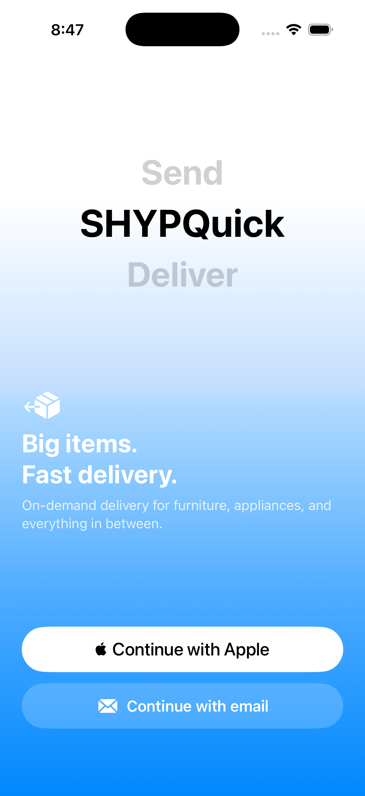
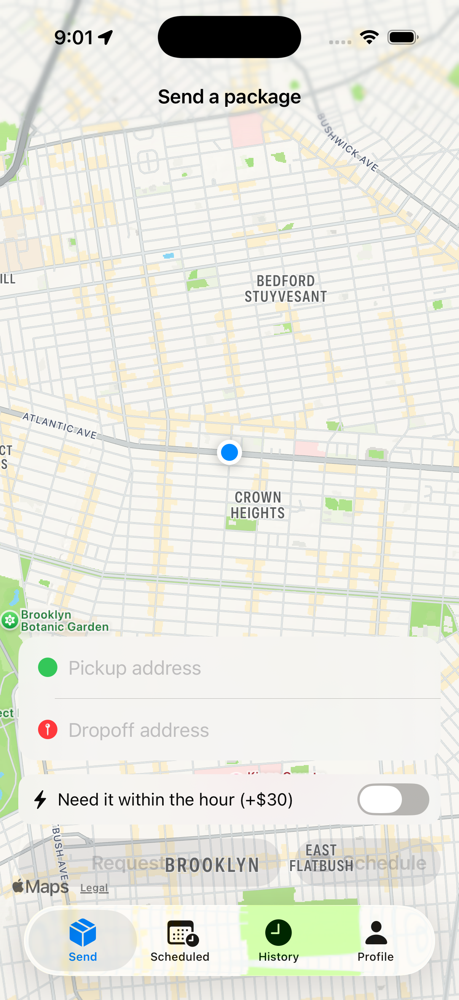
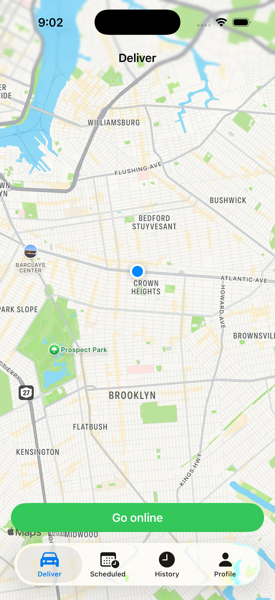

<div align="center">
  <h1>SHYP Quick</h1>

  <p><strong>Shyp all the items you want.</strong></p>

  <p>
    On-demand delivery for furniture, appliances, and everything in between —<br/>
    think Uber, but for the stuff that doesn't fit in an Uber.
  </p>

  <p>
    
    
    
    
  </p>

  <br />

  <table>
  <tr>
  <td align="center" width="33%">
    
    <br/><sub><b>Welcome</b><br/>Sign in with Apple or email.</sub>
  </td>
  <td align="center" width="33%">
    
    <br/><sub><b>Customer — Send a package</b><br/>Live map, address fields, same-hour rush toggle.</sub>
  </td>
  <td align="center" width="33%">
    
    <br/><sub><b>Driver — Go online</b><br/>One tap to start receiving jobs nearby.</sub>
  </td>
  </tr>
  </table>
</div>

---

## What is ShypQuick?

You bought a couch on Craigslist. A dresser from a yard sale. A flat-screen
from Best Buy. Now you need it home — today, not next Tuesday.

**ShypQuick is a two-sided on-demand delivery app.** Customers request a
driver, drivers accept within seconds, and everything in between —
navigation, live tracking, photo of the item, payout — happens in one place.

- **Big items.** Designed for the stuff other delivery apps won't touch.
- **Fast.** Request now, or schedule it for later. Same-hour rush available.
- **Fair.** Drivers keep **70%** of the fare. No opaque take-rate.

## How it works

<table>
<tr>
<th width="50%">🧍 For customers</th>
<th width="50%">🚗 For drivers</th>
</tr>
<tr valign="top">
<td>

1. Enter pickup and drop-off addresses
2. Pick item size — **Fits in a Car** or **Needs a Flatbed**
3. Snap a photo so the driver knows what they're picking up
4. **Request now**, or schedule for later
5. Watch the driver move toward you on the map
6. Rate the driver once delivered

</td>
<td>

1. Go online — a Dynamic Island banner shows you're live
2. Accept an incoming offer within the 5-minute window
3. **Apple Maps auto-launches** toward the pickup
4. Mark picked up → Apple Maps re-routes to drop-off
5. Mark delivered, keep 70% of the fare
6. Back online for the next job

</td>
</tr>
</table>

## Pricing

| | Small (Fits in a Car) | Large (Needs a Flatbed) |
|---|---:|---:|
| **Base fare** | $40 | $150 |
| **Long haul** | +$0.50/mi over 10 mi | +$0.50/mi over 10 mi |
| **Same-hour rush** | +$30 | +$30 |

## Tech stack

| Layer | Tools |
|---|---|
| **iOS app** | SwiftUI (iOS 17+), Swift 5.9, Swift Package Manager |
| **Maps & navigation** | MapKit, CoreLocation, Apple Maps hand-off |
| **Live Activity** | ActivityKit — the "Online" banner on the Lock Screen / Dynamic Island |
| **Backend** | Supabase — Postgres, Auth, Realtime, Storage |
| **Realtime dispatch** | Postgres `LISTEN/NOTIFY` → Supabase Realtime → in-app push offer |
| **Push notifications** | APNs via a Supabase Edge Function (Deno/TypeScript) |
| **Auth** | Email / password, Sign in with Apple |
| **Ship pipeline** | `deploy_testflight.sh` — archive → upload → auto-submit for beta review → attach to tester group, via the App Store Connect API |
| **Payments** *(planned)* | Stripe |

## Architecture at a glance

```
┌──────────────┐         ┌──────────────────────┐         ┌──────────────┐
│   Customer   │  posts  │   Supabase Postgres  │  INSERT │    Driver    │
│  (iOS app)   │ ──────▶ │  (job_offers table)  │ ──────▶ │  (iOS app)   │
└──────────────┘         └──────────┬───────────┘         └──────┬───────┘
                                    │                            │
                                    │  pg_net trigger            │ accepts
                                    ▼                            ▼
                        ┌──────────────────────┐         ┌──────────────┐
                        │  Edge Function       │ ──APNs─▶│   Apple Push │
                        │  (push-new-offer)    │         │  Notif. Svc. │
                        └──────────────────────┘         └──────────────┘
```

- Customers insert into `job_offers`.
- A database trigger fires a `pg_net` POST to the edge function.
- The edge function queries online drivers, signs an APNs JWT (ES256), and pushes to every registered device token. Dead tokens are purged on 410.
- Drivers subscribe to Supabase Realtime on the same table to get the offer inside the app even without a push.

## Status & roadmap

- [x] Two-sided app — customer + driver + both roles in one build
- [x] Instant and scheduled dispatch
- [x] Apple Maps navigation, end-to-end
- [x] Live Activity / Dynamic Island online banner
- [x] APNs push for new offers
- [x] Photo attachment on orders
- [x] Driver onboarding & roster — vehicle, equipment, crew, compliance docs, payout info (see **Driver roster** below)
- [~] Stripe payments — scaffold landed, awaiting Stripe keys (see **Payments** below)
- [ ] Persistent chat between customer and driver
- [ ] In-app ratings and reviews history
- [ ] Public App Store release

## Payments

ShypQuick uses **Apple Pay over Stripe** with an *authorize-on-request,
capture-on-delivery* model:

1. Customer fills out the request, taps **Request now**, picks a category.
2. The app calls the `create-payment-intent` edge function, which creates a
   Stripe PaymentIntent with `capture_method=manual`.
3. The Stripe PaymentSheet (Apple Pay enabled) is presented. The customer's
   card is **authorized** — funds reserved, not yet pulled.
4. Only after the auth succeeds does the app insert the `job_offers` row
   (with `payment_intent_id` set).
5. Driver accepts, navigates, marks **delivered** → a Postgres trigger
   (`capture_on_delivered`) calls `capture-payment-intent`, which captures
   the auth in Stripe and writes back `payment_status='captured'`.
6. If the customer cancels before pickup or the offer expires, the app calls
   `cancel-payment-intent` to **void** the auth (or the auth simply expires
   on Stripe's side after ~7 days).

### Enabling payment in your build

The scaffold is **disabled by default** — without keys, the app preserves
its legacy "request without paying" behavior so existing TestFlight testers
aren't broken.

To turn it on, you need:

| Where | Key | Notes |
|---|---|---|
| `Resources/Secrets.plist` | `STRIPE_PUBLISHABLE_KEY` | `pk_test_…` or `pk_live_…` |
| `Resources/Secrets.plist` | `APPLE_PAY_MERCHANT_ID` | e.g. `merchant.com.Dev.Shyp-Quick` (must be registered in Apple Developer + added to entitlements) |
| Xcode → SPM | `https://github.com/stripe/stripe-ios` | Add `StripePaymentSheet` to the `ShypQuick` target |
| Supabase env | `STRIPE_SECRET_KEY` | `sk_test_…` or `sk_live_…`, set on all three edge functions |
| Supabase env | `PAYMENT_WEBHOOK_SECRET` | Random 32+ char secret, also stored in `vault.decrypted_secrets` as `payment_webhook_secret` for the trigger |

Without the iOS keys, `PaymentService.authorize` returns `.notConfigured`
and the request goes through with no auth. Without `STRIPE_SECRET_KEY` on
the edge functions, they return 503 and the iOS client treats it as
`.notConfigured` (same fallback).

### Edge functions

```
supabase/functions/
  create-payment-intent/    # auth-required, called from iOS pre-request
  capture-payment-intent/   # called from DB trigger on delivered
  cancel-payment-intent/    # auth-required, called from iOS on cancel
```

Deploy the trigger-called function with `--no-verify-jwt` (matches
`push-new-offer`); the others verify JWTs by default.

## Driver roster

Drivers fill out an onboarding & roster profile from **Profile → Driver
details** (visible to `driver` and `both` roles). It captures everything
dispatch needs — basic info, vehicle, equipment, crew, service area &
availability, compliance documents, delivery experience, specialized
services, payout method, and vehicle photos.

| Store | Holds | Access |
|---|---|---|
| `driver_profiles` | The roster row (all non-sensitive fields) | Owner-only RLS |
| `driver_tax_info` | SSN/EIN for 1099 processing — isolated table | Owner-only RLS, never granted to `anon` |
| `driver-documents` bucket | License, insurance, registration & vehicle photos | Private; owner-only folder (`<uid>/…`) |

Schema: `supabase/migrations/20260516000000_driver_onboarding.sql`.

## Contact

Currently in **private TestFlight beta**. Reach out to request access or
send feedback.

---

<div align="center">
  <sub>Built with SwiftUI and Supabase in Brooklyn, NY.</sub>
</div>
